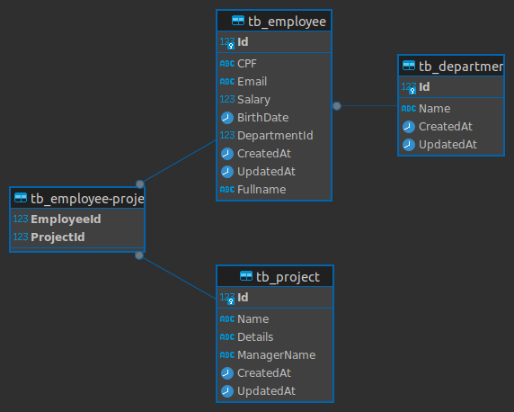

### Employee Management - Backend

Projeto desenvolvido na versão 6.0 do Dotnet. Tem por finalidade mostrar meus conhecimentos  na tecnologia.

### Pacote utilizados
 
 - EntityFrameworkCore
 - MediatR
 - Automapper
 - FluentValidation
 - Newtonsoft
 - Swagger
 - FluentAssertion
 - AutoFixture

### Arquitetura 

Utilizado o padrão CQRS. Mas com algumas modificações na forma de acessar dados. Optei por não utilizar do repository pattern
para evitar over engineering e ter mais flexibilidade nas minhas queries.

### Estrutura das tabelas - Banco de dados
Você pode conferir o script da geração das tabelas na pasta `./docs`

### Forma de rodar o projeto.

Além de está na versão 6 do dotnet, é necessário que tenha o SQLServer no seu ambiente.
Verifique no `appsetting.json` se a instância do seu SqlServer está de acordo com a ConnectionString do seu ambiente.

## Migrations

Dentro do projeto `EmployeeManagement.Api` execute o seguinte comando > `dotnet ef migrations add initial` para gerar
as migrations. Na sequencia, execute `dotnet ef database update` para criar o banco de dados.

__nota: caso o comando não reconheça o comando, verifique se o entity framework tool está instalado no seu ambiente__

### Executar o projeto

Após a configuração acima, você está habilitado testar a aplicação.Ainda no projeto `EmployeeManagement.Api`, abra o terminal 
e  pressione `dotnet run` 
ou pressione o botão `run` caso esteja em alguma IDE. O terminal mostrará a uri que poderá consultar os endpoints. 
## FRONTEND

Voce pode testar esta aplicação utilizando uma interface amigavel, o [FRONTEND](https://github.com/andd3rson/cap_challenge-frontend) 
está disponivel para tal.

enjoy!
